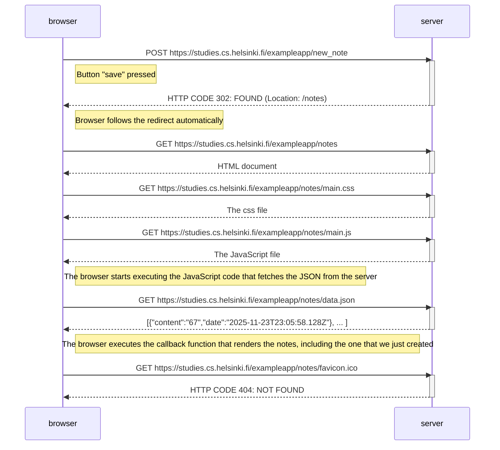

```mermaid
sequenceDiagram
    participant browser
    participant server

    browser->>server: POST https://studies.cs.helsinki.fi/exampleapp/new_note
    activate server
    note right of browser: Button "save" pressed
    server-->>browser: HTTP CODE 302: FOUND (Location: /notes)
    deactivate server
    note right of browser: Browser follows the redirect automatically

    browser->>server: GET https://studies.cs.helsinki.fi/exampleapp/notes
    activate server
    server-->>browser: HTML document
    deactivate server

    browser->>server: GET https://studies.cs.helsinki.fi/exampleapp/notes/main.css
    activate server
    server-->>browser: The css file
    deactivate server

    browser->>server: GET https://studies.cs.helsinki.fi/exampleapp/notes/main.js
    activate server
    server-->>browser: The JavaScript file
    deactivate server

    Note right of browser: The browser starts executing the JavaScript code that fetches the JSON from the server

    browser->>server: GET https://studies.cs.helsinki.fi/exampleapp/notes/data.json
    activate server
    server-->>browser: [{"content":"67","date":"2025-11-23T23:05:58.128Z"}, ... ]
    deactivate server

    Note right of browser: The browser executes the callback function that renders the notes, including the one that we just created

    browser->>server: GET https://studies.cs.helsinki.fi/exampleapp/notes/favicon.ico
    activate server
    server-->>browser: HTTP CODE 404: NOT FOUND
    deactivate server
```
